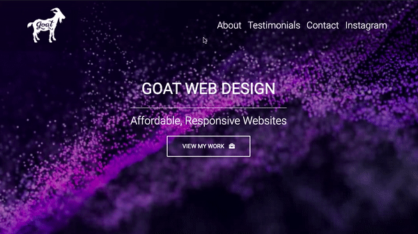

# GOAT Web Designs

[GOAT Website](https://www.goatwebdesigns.com)



Goat Web Design is my freelance web design company! We do frontend & backend prjects for small businesses and sole proprieters. We offer beautiful, responsive design at affordable rates.

# Contributors

Robert Kushner IV

# Features

- Frontend & Backend JavaScript
- PHP
- MDB Design
- CSS
- Frontend JavaScript
- Working Contact Forms, Text Option, QR Code
- Why Goat List
- Testimonials
- IG Feed Embedded
- Google Analytics
- and more!

# PHP Code Sample

```php
<?php
$name = $_POST['name'];
$email = $_POST['email'];
$message = $_POST['message'];
$subject = $_POST['subject'];
header('Content-Type: application/json');
if ($name === ''){
print json_encode(array('message' => 'Name cannot be empty', 'code' => 0));
exit();
}
if ($email === ''){
print json_encode(array('message' => 'Email cannot be empty', 'code' => 0));
exit();
} else {
if (!filter_var($email, FILTER_VALIDATE_EMAIL)){
print json_encode(array('message' => 'Email format invalid.', 'code' => 0));
exit();
}
}
if ($subject === ''){
print json_encode(array('message' => 'Subject cannot be empty', 'code' => 0));
exit();
}
if ($message === ''){
print json_encode(array('message' => 'Message cannot be empty', 'code' => 0));
exit();
}
$content="From: $name \nEmail: $email \nMessage: $message";
$recipient = "robertkushner4@gmail.com";
$mailheader = "From: $email \r\n";
mail($recipient, $subject, $content, $mailheader) or die("Error!");
print json_encode(array('message' => 'Email successfully sent!', 'code' => 1));
exit();
?>
```